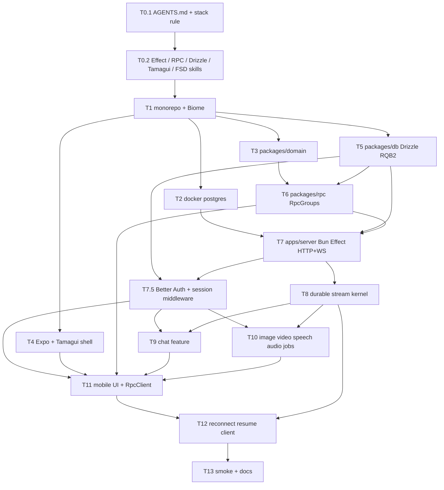

# OpenRouter Mobile Implementation Plan

> **For Claude:** REQUIRED SUB-SKILL: Use superpowers:executing-plans to implement this plan task-by-task.
> **For dispatch:** Tasks marked `parallel` in the same Wave can be given to different agents. Do not start a Wave until every `blocks` item from previous waves is done. Every technology install task MUST land the matching Cursor rule + skill in the same PR/commit as the dependency.

**Goal:** Monorepo Expo (ios/android/web) + Bun/Effect backend that proxies OpenRouter, with typed Effect RPC over HTTP and WebSocket, durable streams that write to Postgres and the socket in parallel, and resume after reconnect.

**Architecture:** Shared `packages/domain` (Effect Schema) and `packages/rpc` (RpcGroup) are the contract. `apps/server` implements handlers as Effect Layers on Bun, persists every stream chunk to Postgres first, then fans out through in-process PubSub to WebSocket subscribers. `apps/mobile` is Expo + Tamagui + Effect ManagedRuntime; chat and generation UIs consume RpcClient streams. Feature-Sliced Design on both apps. Biome is the only linter/formatter.

**Tech Stack:** Bun workspaces + Turborepo, Expo SDK 57, Tamagui v5, Effect v4 + `@effect/rpc` + `@effect/platform-bun` + `@effect/sql-pg` + `@effect/atom-react`, drizzle-orm@rc (1.0 RQB v2, `effect-postgres`), PostgreSQL, Biome, OpenRouter, Better Auth 1.7 (`better-auth`, `@better-auth/expo`, `@better-auth/drizzle-adapter/relations-v2`).

**Auth for MVP:** Better Auth, email/password only (no OAuth, no email verification required). Auth HTTP handler at `/api/auth/*` on the Bun server. Expo client uses `better-auth/react` + `@better-auth/expo/client` + `expo-secure-store`. Effect RPC sends `Cookie` from `authClient.getCookie()`. Server RPC middleware loads session via `auth.api.getSession({ headers })`. Chats and jobs are scoped to `userId`. OpenRouter key stays on the server.

---

## How to dispatch to agents

1. One agent = one Task id (`T0.1`, `T3`, …). Never split a Task across two agents.
2. Before coding, the agent MUST read `AGENTS.md` and every `.cursor/skills/*` listed in the Task.
3. After installing or bumping a library, the agent MUST update the matching skill with the **actual imported API from that version** (copy real signatures, not memory).
4. Do not invent REST, tRPC, oRPC, Zod, Prisma, ESLint, Prettier, Redux, or TanStack Query.
5. Streaming rule (non-negotiable): OpenRouter chunk → insert `stream_events` (get `seq`) → `PubSub.publish` → RPC stream. Reconnect: subscribe live first, replay `seq > afterSeq` from DB, then tail live with dedup.

```text
Wave 0  T0.1 ─────────────────────────────────────────────┐
         T0.2 (parallel with T0.1 after folders exist)     │
                                                           ▼
Wave 1  T1  monorepo + biome  (BLOCKS Wave 2)
                                                           ▼
Wave 2  T2 postgres compose │ T3 domain │ T4 expo+tamagui shell │ T5 drizzle db
         (all four parallel after T1)
                                                           ▼
Wave 3  T6 rpc contract  (needs T3)
        T7 server runtime HTTP+WS  (needs T1, T5, T6; T2 for running)
        T7.5 Better Auth + RPC session middleware (needs T5, T7)
                                                           ▼
Wave 4  T8 durable stream kernel  (needs T5, T6, T7)   ◄── heart of resume
                                                           ▼
Wave 5  T9 chat feature     │ T10 generation jobs
         (parallel; both need T8)
                                                           ▼
Wave 6  T11 mobile RPC client + tabs UI  (needs T4, T6, T9, T10)
        T12 client reconnect/resume      (needs T8, T11)
                                                           ▼
Wave 7  T13 docker README, smoke, leftover AI hint sync
```



---

## Target tree

```text
.
├── AGENTS.md
├── biome.json
├── docker-compose.yml
├── package.json
├── turbo.json
├── .cursor/
│   ├── rules/
│   │   ├── stack.mdc
│   │   ├── effect.mdc
│   │   ├── effect-rpc.mdc
│   │   ├── drizzle.mdc
│   │   ├── expo-tamagui.mdc
│   │   └── fsd.mdc
│   └── skills/
│       ├── effect-this-repo/SKILL.md
│       ├── effect-rpc-streams/SKILL.md
│       ├── drizzle-rqb2/SKILL.md
│       ├── expo-tamagui/SKILL.md
│       ├── fsd-monorepo/SKILL.md
│       └── better-auth/SKILL.md   # plus official pack via `npx skills add better-auth/skills`
├── apps/
│   ├── mobile/                 # Expo Router + Tamagui
│   └── server/                 # Bun + Effect
├── packages/
│   ├── domain/                 # Schema.Class only
│   ├── rpc/                    # RpcGroup only, no handlers
│   └── db/                     # drizzle tables + defineRelations
└── docs/plans/
```

FSD inside apps:

```text
apps/server/src/
  app/main.ts
  shared/{config.ts,runtime.ts,openrouter.ts}
  entities/
  features/chat/
  features/generation/
  features/durable-stream/

apps/mobile/src/
  app/(tabs)/{index,chat,images,video,speech,audio}.tsx
  shared/{runtime.ts,rpc.ts}
  features/{chat,images,video,speech,audio}/
  entities/
```

---

## T0.1 — AGENTS.md + always-on stack rule

**Wave:** 0  
**Parallel with:** nothing until `.cursor/` exists; then T0.2  
**Blocked by:** —  
**Unblocks:** T0.2, T1  
**Skills to write:** none yet (this task creates the index)

**Files:**
- Create: `AGENTS.md`
- Create: `.cursor/rules/stack.mdc`

**Acceptance:** any new agent opening the repo sees the stack and the “forbidden list” without being asked.

**`AGENTS.md` must contain:**

```markdown
# AGENTS

Read before writing code.

## Stack
- Frontend: Expo SDK 57 (ios/android/web), Tamagui v5, Feature-Sliced Design
- RPC: @effect/rpc (NOT tRPC, NOT oRPC, NOT REST)
- Backend: Bun, Effect v4, @effect/platform-bun
- Auth: Better Auth 1.7 (email/password), `@better-auth/expo`, `@better-auth/drizzle-adapter/relations-v2`
- DB: PostgreSQL, drizzle-orm@rc, Relational Queries v2 (`defineRelations`)
- Lint/format: Biome only

## Skills (read the matching one before touching that area)
- Effect code → `.cursor/skills/effect-this-repo/SKILL.md` and `.cursor/rules/effect.mdc`
- RPC / streams / reconnect → `.cursor/skills/effect-rpc-streams/SKILL.md`
- Drizzle → `.cursor/skills/drizzle-rqb2/SKILL.md`
- Expo/Tamagui → `.cursor/skills/expo-tamagui/SKILL.md`
- Folder structure → `.cursor/skills/fsd-monorepo/SKILL.md`
- Auth → `.cursor/skills/better-auth/SKILL.md` and the official Better Auth skill pack

## Hard rules
- OpenRouter API key never leaves `apps/server`
- Every stream chunk is persisted to `stream_events` BEFORE PubSub publish
- Reconnect protocol: subscribe live → replay DB `seq > afterSeq` → tail live, dedup by seq
- Effect Schema only (no Zod)
- Auth is Better Auth only (no NextAuth, Clerk, custom JWT). RPC requires a session cookie.
```

**`.cursor/rules/stack.mdc`:**

```markdown
---
description: Canonical stack and forbidden libraries for this monorepo
alwaysApply: true
---

Use Expo + Tamagui on the client, Bun + Effect v4 on the server, @effect/rpc as the only app API, Better Auth for sessions, drizzle-orm@rc with defineRelations, Biome for lint/format.

Do not add tRPC, oRPC, REST routers (except Better Auth `/api/auth/*`), Zod, Prisma, ESLint, Prettier, Redux, TanStack Query, NextAuth, or Clerk.

If Effect usage is unclear, open `.cursor/skills/effect-this-repo/SKILL.md` before writing code.
If auth usage is unclear, open `.cursor/skills/better-auth/SKILL.md` and the official Better Auth skills.
```

---

## T0.2 — Project skills and glob rules for Effect / RPC / Drizzle / Tamagui / FSD

**Wave:** 0  
**Parallel with:** internal files in this task may be written in parallel  
**Blocked by:** T0.1  
**Unblocks:** T1 (agents after T1 must follow these)  
**Note:** These are first-pass templates. Install tasks (T3–T7, T11) MUST patch the same files with real imports from the installed package versions.

**Files:**
- Create: `.cursor/rules/effect.mdc` (`globs: **/*.{ts,tsx}`)
- Create: `.cursor/rules/effect-rpc.mdc` (`globs: packages/rpc/**/*.ts,apps/server/**/*.ts,apps/mobile/src/shared/rpc.ts`)
- Create: `.cursor/rules/drizzle.mdc` (`globs: packages/db/**/*.ts`)
- Create: `.cursor/rules/expo-tamagui.mdc` (`globs: apps/mobile/**/*.{ts,tsx}`)
- Create: `.cursor/rules/fsd.mdc` (`globs: apps/**/*.{ts,tsx}`)
- Create: `.cursor/skills/effect-this-repo/SKILL.md`
- Create: `.cursor/skills/effect-rpc-streams/SKILL.md`
- Create: `.cursor/skills/drizzle-rqb2/SKILL.md`
- Create: `.cursor/skills/expo-tamagui/SKILL.md`
- Create: `.cursor/skills/fsd-monorepo/SKILL.md`
- Create: `.cursor/skills/better-auth/SKILL.md`
- Create: `.cursor/rules/better-auth.mdc` (`globs: apps/server/**/*auth*,apps/mobile/**/*auth*`)
- Run: `npx skills add better-auth/skills` into the **project** skills directory (`.cursor/skills` or whatever the CLI uses). If the CLI wants a global install, copy the pack into `.cursor/skills/better-auth-official/` instead so it is in the repo.

**`effect-this-repo/SKILL.md` description (frontmatter, auto-invoke, do NOT set `disable-model-invocation`):**

```yaml
name: effect-this-repo
description: How this repo uses Effect v4 — Effect.gen, Layers, Schema, ManagedRuntime, BunRuntime. Use when writing or reviewing any Effect, Layer, Schema, Stream, or Rpc handler code.
```

**Body must include these anti-patterns (verbatim intent):**

```markdown
# Effect in this repo

## Do
- `Effect.gen(function* () { const x = yield* Service })`
- Errors as `Schema.TaggedError` / `Data.TaggedError`
- Wire dependencies with `Layer.provide` / `Layer.mergeAll`
- Server entry: `BunRuntime.runMain(Layer.launch(Main))`
- Mobile entry: one `ManagedRuntime` in `apps/mobile/src/shared/runtime.ts`
- Streams: `Stream`, never ad-hoc callback accumulation for OpenRouter

## Do not
- `try/catch` around Effect programs
- `Effect.runPromise` inside React render (only inside runtime / event handlers)
- Zod, io-ts, yup
- Newing services (`new Foo()`) instead of `Context.Service` + Layer
- Importing `apps/server` from `apps/mobile`

## Schema
- `Schema.Class` in `packages/domain` for DTOs
- RPC payload/success/error use those classes
- Decode at the boundary; inside the app use the decoded type
```

**`effect-rpc-streams/SKILL.md` must specify the resume algorithm** (full code is in T8; the skill points agents at it):

```markdown
Producer: persist → publish (never publish first).
Consumer: subscribe live (wait until subscribed) → replay seq > afterSeq → concat live filtered seq > max(replayed).
Client payload always has `afterSeq: Schema.optionalKey(Schema.Number)`.
Client stores last `seq` from the stream and sends it on reconnect.
Do not use Socket.IO. Transports are RpcServer.layerProtocolHttp and layerProtocolWebsocket only.
```

**`drizzle-rqb2/SKILL.md` must say:**

```markdown
- `drizzle-orm@rc` + `drizzle-kit@rc`
- Relations via `defineRelations` in `packages/db/src/relations.ts`, NOT per-table `relations()`
- Pass `relations` into `drizzle()` / `PgDrizzle.make({ relations })`
- Effect driver: `drizzle-orm/effect-postgres` + `@effect/sql-pg`
- Do not use RQB v1 (`db._query`)
```

**`expo-tamagui/SKILL.md` must say:** Expo 57, `expo/fetch` for Effect FetchHttpClient, WebSocket `binaryType = "arraybuffer"`, Tamagui `createTamagui` from `@tamagui/config/v5`, Expo Router tabs, no nested `File` in RPC payloads (upload via HTTP then RPC id).

**`fsd-monorepo/SKILL.md` must say:** import direction `app → features → entities → shared`; features never import other features; RPC types come from `packages/rpc`, never duplicated in the UI.

**`better-auth/SKILL.md` (auto-invoke, no `disable-model-invocation`) description:**

```yaml
name: better-auth
description: How this repo uses Better Auth 1.7 with Expo and Drizzle Relations v2. Use when writing auth, sessions, sign-in, sign-up, cookies, or RPC AuthMiddleware.
```

Body must include:

```markdown
- Packages: `better-auth`, `@better-auth/expo`, `@better-auth/drizzle-adapter`
- Adapter: `drizzleAdapter` from `@better-auth/drizzle-adapter/relations-v2`, provider `"pg"`
- Server plugin: `expo()` from `@better-auth/expo`
- Mount `auth.handler` on GET+POST `/api/auth/*` (Better Auth HTTP, not Effect RPC)
- Email/password enabled; do not require email verification for MVP
- Env: `BETTER_AUTH_SECRET` (>=32 chars), `BETTER_AUTH_URL`
- Expo client: `createAuthClient` from `better-auth/react` + `expoClient` from `@better-auth/expo/client` + `expo-secure-store`
- RPC: `headers: { Cookie: await authClient.getCookie() }`, `credentials: "omit"` on native
- Server session: `auth.api.getSession({ headers: requestHeaders })`
- Schema via `bun x auth@latest generate` then merge auth relations into `defineRelations` with `{ ...appRelations, ...authRelations }`
- Docs: https://better-auth.com/docs/integrations/expo and https://better-auth.com/docs/adapters/drizzle
```

After writing, patch this skill with real imports from the installed package versions (T7.5).

---

## T1 — Monorepo cleanup, Biome, Turbo

**Wave:** 1  
**Parallel with:** —  
**Blocked by:** T0.2  
**Unblocks:** T2, T3, T4, T5

**Files:**
- Modify: `package.json`, `turbo.json`, `.gitignore`
- Create: `biome.json`
- Delete leftover Next/eslint/prettier if any files remain
- Create empty workspace package.json stubs only if needed for bun workspaces: `apps/mobile`, `apps/server`, `packages/domain`, `packages/rpc`, `packages/db`

**Steps:**
1. Remove `prettier` from root. Add `@biomejs/biome`. Keep `turbo`, `typescript` (Expo app may pin its own; do not force TS 7 on Expo if the template refuses — note the chosen version in `expo-tamagui` skill).
2. Root scripts: `dev`, `build`, `check` (`biome check .`), `check:fix`, `check-types`.
3. `turbo.json` outputs: drop `.next/**`. Add `dist/**` for server/packages. `dev` persistent uncached.
4. `package.json` `"packageManager": "bun@1.4.2"` (already in devEngines).
5. Update `.cursor/skills` one-liner: “format/lint is `bun run check` (Biome), never eslint/prettier”.

**Verify:** `bun install` and `bunx biome check .` succeed on empty stubs.

---

## T2 — PostgreSQL via docker compose

**Wave:** 2  
**Parallel with:** T3, T4, T5  
**Blocked by:** T1  
**Unblocks:** T7 (runtime), T8 (integration)

**Files:**
- Create: `docker-compose.yml`
- Create: `.env.example` (`DATABASE_URL`, `OPENROUTER_API_KEY`, `RPC_HTTP_URL`, `RPC_WS_URL`, `BETTER_AUTH_SECRET`, `BETTER_AUTH_URL`)
- Modify: `.gitignore` (keep `.env` ignored)

```yaml
services:
  postgres:
    image: postgres:17
    environment:
      POSTGRES_USER: openrouter
      POSTGRES_PASSWORD: openrouter
      POSTGRES_DB: openrouter
    ports: ["5432:5432"]
    volumes: [pgdata:/var/lib/postgresql/data]
volumes:
  pgdata:
```

**Verify:** `docker compose up -d` then `psql` or `bun` ping.

---

## T3 — `packages/domain` Effect Schema

**Wave:** 2  
**Parallel with:** T2, T4, T5  
**Blocked by:** T1  
**Unblocks:** T6  
**Also update:** `.cursor/skills/effect-this-repo/SKILL.md` with the real `Schema.Class` import path from the installed `effect` version.

**Files:**
- Create: `packages/domain/package.json` (`name: "@repo/domain"`, `"type": "module"`)
- Create: `packages/domain/src/index.ts`
- Create: `packages/domain/src/{Chat,Message,StreamEvent,GenerationJob,TokenChunk,JobEvent,AppError}.ts`
- Create: `packages/domain/src/ids.ts`

**Required models (Schema.Class / TaggedError):**

```ts
export class AppError extends Schema.TaggedError<AppError>()("AppError", {
  code: Schema.Literals(["UNAUTHORIZED", "NOT_FOUND", "OPENROUTER", "STREAM_GONE"]),
  message: Schema.String,
}) {}

export class TokenChunk extends Schema.Class<TokenChunk>("TokenChunk")({
  seq: Schema.Number,
  text: Schema.String,
}) {}

export class JobEvent extends Schema.Class<JobEvent>("JobEvent")({
  seq: Schema.Number,
  status: Schema.Literals(["queued", "running", "completed", "failed"]),
  progress: Schema.optionalKey(Schema.Number),
  url: Schema.optionalKey(Schema.String),
  error: Schema.optionalKey(Schema.String),
}) {}

export class StreamEvent extends Schema.Class<StreamEvent>("StreamEvent")({
  streamId: Schema.String,
  seq: Schema.Number,
  kind: Schema.Literals(["token", "job"]),
  payload: Schema.Unknown,
  createdAt: Schema.DateTimeUtc,
}) {}
```

Plus `Chat`, `Message`, `GenerationJob` with ids as branded strings.

**Verify:** `bun run check-types --filter=@repo/domain`

---

## T4 — Expo + Tamagui shell (no RPC yet)

**Wave:** 2  
**Parallel with:** T2, T3, T5  
**Blocked by:** T1  
**Unblocks:** T11  
**Also update:** `.cursor/skills/expo-tamagui/SKILL.md` with the exact Tamagui config import (`@tamagui/config/v5` or whatever the installed version exports) and Expo Router file names.

**Files:**
- Create: `apps/mobile/**` via Expo SDK 57 template, then Tamagui provider per Tamagui Expo guide
- Create: `apps/mobile/src/app/_layout.tsx` — `TamaguiProvider` + tabs
- Create: `apps/mobile/src/app/(tabs)/_layout.tsx` — tabs: Chat, Images, Video, Speech, Audio
- Create: placeholder screens for each tab (static copy, no API)
- Create: `apps/mobile/tamagui.config.ts`
- Set Expo `scheme` to `openrouter-mobile` in app config (needed later for Better Auth deep links)

**Constraints:**
- Single codebase web + native.
- `expo/fetch` available (SDK 57 global fetch streams; still document injecting `expo/fetch` into Effect HTTP client in T11).
- Do not install TanStack Query.

**Verify:** `bun run --filter mobile start` loads web; tabs visible. If browser tools exist, click every tab.

---

## T5 — `packages/db` Drizzle 1.0 RC + relations 2.0

**Wave:** 2  
**Parallel with:** T2, T3, T4  
**Blocked by:** T1  
**Unblocks:** T6, T7, T8  
**Also update:** `.cursor/skills/drizzle-rqb2/SKILL.md` with copy-pasted `defineRelations` example from the installed `drizzle-orm` types.

**Files:**
- Create: `packages/db/package.json` (`drizzle-orm@rc`, `drizzle-kit@rc`, `@effect/sql-pg`)
- Create: `packages/db/drizzle.config.ts`
- Create: `packages/db/src/schema/{chats,messages,generationJobs,streamEvents}.ts`
- Create: `packages/db/src/relations.ts`
- Create: `packages/db/src/index.ts`

**`stream_events` is the resume ledger (do not skip):**

```ts
export const streamEvents = pgTable(
  "stream_events",
  {
    streamId: uuid("stream_id").notNull(),
    seq: bigint("seq", { mode: "number" }).generatedByDefaultAsIdentity(),
    kind: text("kind").notNull(), // token | job
    payload: jsonb("payload").notNull(),
    createdAt: timestamp("created_at", { withTimezone: true }).defaultNow().notNull(),
  },
  (t) => [primaryKey({ columns: [t.streamId, t.seq] }), index("stream_events_stream_seq").on(t.streamId, t.seq)],
)
```

Other tables: `chats` (id, userId, title, createdAt), `messages` (chatId, role, content, createdAt), `generation_jobs` (id, userId, kind image|video|speech|audio, status, prompt, resultUrl, error, createdAt). `userId` is a text/uuid column filled in T7.5 after Better Auth `user` exists; T5 may leave it as `text` without FK, T7.5 adds FK to `user.id`.

**Relations v2 — one file, `defineRelations`, not v1 `relations()`:**

```ts
import { defineRelations } from "drizzle-orm"
import * as schema from "./schema"

export const relations = defineRelations(schema, (r) => ({
  chats: {
    messages: r.many.messages(),
  },
  messages: {
    chat: r.one.chats({ from: r.messages.chatId, to: r.chats.id }),
  },
  generationJobs: {},
  streamEvents: {},
}))
```

Adjust to the actual `defineRelations` callback API of the installed rc (this is the #1 place agents get v1/v2 wrong — verify against `node_modules/drizzle-orm` and patch the skill).

**Verify:** `bunx drizzle-kit generate` in `packages/db` produces SQL with `stream_events`.

---

## T6 — `packages/rpc` Effect RPC contract

**Wave:** 3  
**Parallel with:** can start as soon as T3+T5 types exist; handlers wait for T7  
**Blocked by:** T3, T5 (ids/tables conceptually; T5 not strictly imported here)  
**Unblocks:** T7, T11  
**Also update:** `.cursor/skills/effect-rpc-streams/SKILL.md` with real `Rpc.make` / `RpcGroup.make` signatures from `@effect/rpc`.

**Files:**
- Create: `packages/rpc/src/{ChatRpcs,JobRpcs,MediaRpcs,HealthRpcs}.ts`
- Create: `packages/rpc/src/AppRpcs.ts` — merge groups
- Create: `packages/rpc/src/index.ts`

**Contract (this is the socket contract AND the HTTP contract):**

```ts
export class ChatRpcs extends RpcGroup.make(
  Rpc.make("ChatList", { success: Schema.Array(Chat), error: AppError }),
  Rpc.make("ChatCreate", { success: Chat, error: AppError }),
  Rpc.make("ChatMessages", {
    payload: { chatId: Schema.String, afterSeq: Schema.optionalKey(Schema.Number) },
    success: Schema.Array(Message),
    error: AppError,
  }),
  Rpc.make("ChatSend", {
    payload: {
      chatId: Schema.String,
      content: Schema.String,
      afterSeq: Schema.optionalKey(Schema.Number),
    },
    success: TokenChunk,
    error: AppError,
    stream: true,
  }),
) {}

export class JobRpcs extends RpcGroup.make(
  Rpc.make("JobGet", {
    payload: { jobId: Schema.String },
    success: GenerationJob,
    error: AppError,
  }),
  Rpc.make("JobSubscribe", {
    payload: {
      jobId: Schema.String,
      afterSeq: Schema.optionalKey(Schema.Number),
    },
    success: JobEvent,
    error: AppError,
    stream: true,
  }),
) {}

export class MediaRpcs extends RpcGroup.make(
  Rpc.make("ImageGenerate", { payload: { prompt: Schema.String }, success: GenerationJob, error: AppError }),
  Rpc.make("VideoGenerate", { payload: { prompt: Schema.String }, success: GenerationJob, error: AppError }),
  Rpc.make("SpeechSynthesize", { payload: { text: Schema.String, voice: Schema.optionalKey(Schema.String) }, success: GenerationJob, error: AppError }),
  Rpc.make("AudioTranscribe", { payload: { assetId: Schema.String }, success: GenerationJob, error: AppError }),
) {}
```

No handlers in this package. No Socket.IO types. Transport is chosen by the server/client Layers in T7/T11.

**Verify:** package typechecks; `AppRpcs` exported.

---

## T7 — `apps/server` Bun + Effect HTTP and WebSocket

**Wave:** 3  
**Parallel with:** T6 if T6 already merged; otherwise after T6  
**Blocked by:** T2, T5, T6  
**Unblocks:** T7.5, T8  
**Also update:** effect skills with real `RpcServer.layerProtocolHttp` / `layerProtocolWebsocket` / `BunHttpServer` imports.

**Files:**
- Create: `apps/server/src/app/main.ts`
- Create: `apps/server/src/shared/{config.ts,db.ts,runtime.ts}`
- Create: `apps/server/src/features/health/HealthLive.ts`

**Server wiring (adapt names to installed `@effect/rpc`):**

```ts
const HttpProtocol = RpcServer.layerProtocolHttp({ path: "/rpc" }).pipe(
  Layer.provide(RpcSerialization.layerNdjson),
)
const WsProtocol = RpcServer.layerProtocolWebsocket({ path: "/rpc/ws" }).pipe(
  Layer.provide(RpcSerialization.layerNdjson),
)

const Main = HttpRouter.Default.serve().pipe(
  Layer.provide(RpcServer.layer(AppRpcs)),
  Layer.provide(HttpProtocol),
  Layer.provide(WsProtocol),
  Layer.provide(BunHttpServer.layer({ port: 3000 })),
  Layer.provide(DbLive),
  Layer.provide(ConfigLive),
)

BunRuntime.runMain(Layer.launch(Main))
```

`DbLive`: `@effect/sql-pg` `PgClient.layer` + `drizzle-orm/effect-postgres` `PgDrizzle.make({ relations })` as in drizzle 1.0.0-rc.1 release notes.

Health RPC returns `{ ok: true }`.

Leave a catch-all slot in the HTTP router for `/api/auth/*` (T7.5 fills it). Health may stay public.

**Verify:** `curl` or Effect client `Health` over HTTP. WebSocket upgrade on `/rpc/ws` does not 404.

---

## T7.5 — Better Auth + RPC session middleware

**Wave:** 3  
**Parallel with:** — after T7  
**Blocked by:** T5, T7  
**Unblocks:** T9, T10, T11  
**Also update:** `.cursor/skills/better-auth/SKILL.md` with real imports from the installed `better-auth` / `@better-auth/expo` / `@better-auth/drizzle-adapter` versions. Follow official docs: https://better-auth.com/docs/integrations/expo and https://better-auth.com/docs/adapters/drizzle (Relations v2).

**Files:**
- Create: `apps/server/src/shared/auth.ts` — `betterAuth({ ... })` exported as `auth`
- Create: `packages/db/src/schema/auth.ts` — generated via `bun x auth@latest generate`
- Modify: `packages/db/src/relations.ts` — merge `{ ...appRelations, ...authRelations }`
- Modify: `apps/server/src/app/main.ts` — mount `auth.handler` on GET+POST `/api/auth/*`
- Create: `apps/server/src/shared/AuthMiddleware.ts` — Effect RPC middleware
- Modify: chats/jobs schema FK `userId` → `user.id` if not already

**Server auth instance (adapt to installed APIs):**

```ts
import { betterAuth } from "better-auth"
import { expo } from "@better-auth/expo"
import { drizzleAdapter } from "@better-auth/drizzle-adapter/relations-v2"

export const auth = betterAuth({
  database: drizzleAdapter(db, { provider: "pg", schema: authSchema }),
  emailAndPassword: { enabled: true },
  plugins: [expo()],
  trustedOrigins: [
    "openrouter-mobile://",
    "http://localhost:8081",
    "http://localhost:3000",
    ...(process.env.NODE_ENV === "development" ? ["exp://", "exp://**"] : []),
  ],
})
```

Mount with the Fetch/Request API (Bun/Effect HttpRouter), same idea as Hono:

```ts
// GET+POST /api/auth/*
(request) => auth.handler(request)
```

**RPC middleware:** every procedure except `Health` requires a session:

```ts
const session = yield* Effect.tryPromise({
  try: () => auth.api.getSession({ headers: incomingHeaders }),
  catch: () => new AppError({ code: "UNAUTHORIZED", message: "Not signed in" }),
})
if (!session) return yield* Effect.fail(new AppError({ code: "UNAUTHORIZED", message: "Not signed in" }))
// put session.user.id on RPC context
```

Do not wrap Better Auth internals in a fake Effect service beyond a thin `Auth` Context that exposes `getSession` and the `auth` instance. Keep `betterAuth()` as the source of truth.

**Verify:**
- `POST /api/auth/sign-up/email` creates a user row
- `POST /api/auth/sign-in/email` sets cookies
- RPC `ChatList` without Cookie → UNAUTHORIZED
- RPC `ChatList` with Cookie → empty list (not 401)

---

## T8 — Durable stream kernel (DB ∥ socket, resume)

**Wave:** 4  
**Parallel with:** — (this is the bottleneck; do not start T9/T10 without it)  
**Blocked by:** T5, T6, T7  
**Unblocks:** T9, T10, T12  
**Skills:** MUST follow `.cursor/skills/effect-rpc-streams/SKILL.md`. After implementation, paste the final function signatures into that skill so later agents copy the real API.

This is the feature you asked for: one Effect `Stream` that **in parallel** (1) appends to Postgres and (2) pushes to WebSocket subscribers, and that **restores** the flow when the user drops and reconnects.

### Design (do not “simplify” this away)

**Source of truth** is `stream_events(stream_id, seq, payload)`. In-memory `PubSub` is only a wake-up / live tail for the current Bun process. If nobody is connected, chunks still land in DB. Reconnect never depends on the old socket.

**Producer** (`DurableStream.append` / `runInto`):

```ts
// For each OpenRouter chunk:
// 1. INSERT stream_events RETURNING seq
// 2. PubSub.publish(streamId, { seq, kind, payload })
// Never publish before the insert commits.
```

Use `Stream.tap` / `Stream.mapEffect` with concurrency 1 for append (seq order matters). Fan-out to PubSub is after insert, still in the same fiber, so order is preserved. “Parallel” here means the **user-facing socket** receives the event as soon as it is durable, without waiting for the full OpenRouter completion — not “insert and publish racing”.

**Consumer** (`DurableStream.subscribe(streamId, afterSeq)`):

Race-free catch-up (subscribe first, then snapshot):

```ts
export const subscribe = (streamId: string, afterSeq: number | undefined) =>
  Stream.unwrapScoped(
    Effect.gen(function* () {
      const live = yield* pubsub.subscribe(streamId) // Queue; ready AFTER subscribed
      const replay = yield* db.query.streamEvents.findMany({
        where: (e, ops) =>
          ops.and(ops.eq(e.streamId, streamId), ops.gt(e.seq, afterSeq ?? 0)),
        orderBy: (e, ops) => ops.asc(e.seq),
      })
      const watermark = replay.at(-1)?.seq ?? afterSeq ?? 0
      return Stream.concat(
        Stream.fromIterable(replay),
        Stream.fromQueue(live).pipe(Stream.filter((e) => e.seq > watermark)),
      )
    }),
  )
```

If the installed Drizzle API differs, keep the algorithm, change only query syntax.

**RPC mapping:** `ChatSend` and `JobSubscribe` return this stream mapped to `TokenChunk` / `JobEvent`. Client sends `afterSeq`.

### Tests (write first)

**Files:**
- Create: `apps/server/src/features/durable-stream/DurableStream.ts`
- Create: `apps/server/src/features/durable-stream/DurableStreamLive.ts`
- Create: `apps/server/test/durable-stream.test.ts`

**Test cases:**

1. `append` writes a row with monotonic `seq` per `streamId`.
2. Two subscribers both receive the same event after append (PubSub fan-out).
3. **Reconnect:** append 1..5, subscriber saw 1..3 then interrupt; new `subscribe(afterSeq=3)` yields 4,5 then live 6.
4. **Gap during disconnect:** no subscriber; append 1..10; `subscribe(afterSeq=0)` yields 1..10 in order.
5. Dedup: overlapping replay and live does not double-emit a seq.

Run with `bun test`. Use a test Postgres (compose) or transactional cleanup.

**Verify:** all five tests green. Then update `effect-rpc-streams` skill with “copy this subscribe/append, do not reinvent”.

---

## T9 — Chat feature (server)

**Wave:** 5  
**Parallel with:** T10  
**Blocked by:** T8, T7.5  
**Unblocks:** T11

**Files:**
- Create: `apps/server/src/features/chat/{ChatLive.ts,OpenRouterChat.ts}`
- Create: `apps/server/src/shared/openrouter.ts` — Effect HTTP client to `https://openrouter.ai/api/v1/chat/completions` with `stream: true`

**Behavior:**
- All chat queries filtered by `session.user.id`. Never return another user's chats.
- `ChatCreate` / `ChatList` / `ChatMessages` via Drizzle.
- `ChatSend`: insert user message → create `streamId` (= chat message id or dedicated uuid) → OpenRouter stream → for each token `DurableStream.append` → handler returns `DurableStream.subscribe` so a reconnecting client uses the same `ChatSend`/`JobSubscribe` pattern. Prefer: `ChatSend` starts generation (fork fiber) and returns the subscribe stream immediately, so reconnect is `ChatSend` with same chatId + afterSeq OR a dedicated `ChatSubscribe`. **Pick `ChatSubscribe(chatId, afterSeq)`** if `ChatSend` twice would duplicate OpenRouter calls.

**Add to T6 if missing (small contract amend, same agent may patch `packages/rpc`):**

```ts
Rpc.make("ChatSubscribe", {
  payload: { chatId: Schema.String, afterSeq: Schema.optionalKey(Schema.Number) },
  success: TokenChunk,
  error: AppError,
  stream: true,
})
```

`ChatSend` starts the OpenRouter fiber once (idempotent per user message id). `ChatSubscribe` only tails the ledger.

**Verify:** integration test: send “hi”, receive at least one token, row in `messages` and `stream_events`. Kill the “client” mid-stream, `ChatSubscribe(afterSeq=n)` continues.

---

## T10 — Image / video / speech / audio jobs (server)

**Wave:** 5  
**Parallel with:** T9  
**Blocked by:** T8, T7.5  
**Unblocks:** T11

**Files:**
- Create: `apps/server/src/features/generation/{GenerationLive.ts,OpenRouterMedia.ts}`

**Behavior:**
- Jobs scoped to `session.user.id`. `JobGet` / `JobSubscribe` 404/UNAUTHORIZED if the job is not owned by the session user.
- Each generate RPC inserts `generation_jobs` (status queued), forks a fiber that calls the matching OpenRouter endpoint, appends `JobEvent`s to `DurableStream` (`streamId = jobId`).
- `JobSubscribe` = `DurableStream.subscribe(jobId, afterSeq)` mapped to `JobEvent`.
- Stub OpenRouter payloads if a modality is not available yet, but still go through the job+stream kernel (fake progress events). Do not skip the ledger.

**Verify:** `ImageGenerate` returns a job id; `JobSubscribe` gets `queued → running → completed`; reconnect with `afterSeq` does not miss `completed`.

---

## T11 — Mobile Effect runtime, RpcClient, Tamagui UI

**Wave:** 6  
**Parallel with:** T12 starts only after a minimal client exists; do not parallel T12 with first UI  
**Blocked by:** T4, T6, T7.5, T9, T10  
**Unblocks:** T12  
**Also update:** expo-tamagui + effect + better-auth skills with the real FetchHttpClient + websocket + authClient wiring.

**Files:**
- Create: `apps/mobile/src/shared/runtime.ts` — `ManagedRuntime` with Rpc layers
- Create: `apps/mobile/src/shared/auth-client.ts` — `createAuthClient` + `expoClient` + SecureStore
- Create: `apps/mobile/src/shared/rpc.ts` — `RpcClient.make(AppRpcs)` with Cookie from `authClient.getCookie()`
- Create: `apps/mobile/src/shared/http.ts` — `FetchHttpClient` using `expo/fetch`
- Create: `apps/mobile/src/shared/ws.ts` — websocket protocol to `EXPO_PUBLIC_RPC_WS_URL`, `binaryType = "arraybuffer"`, same Cookie header
- Create: `apps/mobile/src/app/sign-in.tsx` and `sign-up.tsx` (Tamagui)
- Create: `apps/mobile/src/features/chat/*`
- Create: `apps/mobile/src/features/images/*` (and video, speech, audio)
- Modify: root layout — if no session, redirect to sign-in

**Auth client (from Better Auth Expo docs):**

```ts
import { createAuthClient } from "better-auth/react"
import { expoClient } from "@better-auth/expo/client"
import * as SecureStore from "expo-secure-store"

export const authClient = createAuthClient({
  baseURL: process.env.EXPO_PUBLIC_AUTH_URL, // e.g. http://localhost:3000
  plugins: [
    expoClient({
      scheme: "openrouter-mobile",
      storagePrefix: "openrouter-mobile",
      storage: SecureStore,
    }),
  ],
})
```

RPC headers must include `Cookie: await authClient.getCookie()` and native fetch `credentials: "omit"` so the manual cookie is not clobbered.

**Client transport split:**
- Queries/mutations (`ChatList`, `ImageGenerate`, …): HTTP NDJSON `/rpc`
- Streams (`ChatSubscribe`, `JobSubscribe`): WebSocket `/rpc/ws`

**UI (basic, not polished):**
- Chat tab: list + thread + composer; tokens append as they stream
- Images/Video/Speech/Audio tabs: prompt field, generate button, status + result (image/url/audio player)
- Use Tamagui: `YStack`, `Input`, `Button`, `ScrollView`, `Text`
- Use `@effect/atom-react` or a tiny hook `useRpcStream` that runs the stream on the ManagedRuntime and stores `afterSeq` in React state + `AsyncStorage`

**Verify in browser (required):** sign up, land on tabs; send a chat message, see tokens appear; open Images, submit prompt, see job status. Sign out, RPC must 401. Click all five tabs. Empty state and error state (kill server) should not crash.

---

## T12 — Client reconnect restores the stream

**Wave:** 6–7  
**Parallel with:** — after T11  
**Blocked by:** T8, T11  
**Unblocks:** T13

**Files:**
- Modify: `apps/mobile/src/shared/ws.ts` (reconnect the Effect RPC websocket protocol; enable reconnect if the API has it)
- Modify: `apps/mobile/src/features/chat/useChatStream.ts`
- Modify: `apps/mobile/src/features/generation/useJobStream.ts`
- Create: `apps/mobile/src/shared/afterSeq.ts` — persist last seq per streamId

**Behavior:**
- On every chunk, save `afterSeq = chunk.seq`.
- On WS close/error, backoff reconnect, call `ChatSubscribe` / `JobSubscribe` with stored `afterSeq`.
- UI concatenates without duplicating seq (Set or `seq > last`).
- If server returns `STREAM_GONE`, show error, do not loop.

**Verify:** start a long chat, toggle airplane / stop and start server / DevTools offline. After reconnect, missing tokens appear in order, no duplicates. Same for a long fake image job.

---

## T13 — Smoke, README, skill freeze

**Wave:** 7  
**Parallel with:** —  
**Blocked by:** T12  
**Unblocks:** —

**Files:**
- Modify: `README.md` (dev: compose, `bun install`, `bun run dev`, env vars)
- Modify: every `.cursor/skills/*/SKILL.md` — remove guesses, keep only APIs that exist in the repo
- Modify: `AGENTS.md` if paths drifted

**Verify:**
- `bun run check` (Biome) clean
- `bun run check-types` clean
- `docker compose up -d` + server + mobile web: sign up, chat stream + one generation tab
- Skills mention real file paths (`DurableStream.ts`, `AppRpcs.ts`, `runtime.ts`, `auth.ts`)

---

## Agent cheat sheet (copy into dispatch prompt)

```text
You are implementing Task {ID} from docs/plans/2026-09-11-openrouter-mobile.md.
Read AGENTS.md and the skills listed in that task first.
Do not start if Blocked-by tasks are not already on main/this branch.
If you install or bump a library, update the matching .cursor/skills file with real imports.
Do not add REST (except Better Auth /api/auth/*), tRPC, oRPC, Zod, ESLint, Prettier, TanStack Query, NextAuth, Clerk.
Streaming: persist stream_events then PubSub; reconnect = subscribe live, replay seq > afterSeq, tail with dedup.
Auth: Better Auth email/password; RPC Cookie from authClient.getCookie(); chats/jobs scoped to session.user.id.
```

### Suggested parallel batches

| Batch | Agents | Tasks |
| --- | --- | --- |
| A | 1 | T0.1 then T0.2 (same agent is fine; skills must be consistent) |
| B | 1 | T1 |
| C | 4 | T2, T3, T4, T5 |
| D | 1–2 | T6 then T7 then T7.5 |
| E | 1 | T8 (do not parallelize; tests define the kernel) |
| F | 2 | T9, T10 |
| G | 1 | T11 then T12 |
| H | 1 | T13 |

---

## Out of scope (do not do in this plan)

- OAuth/social login, email verification, billing, orgs, 2FA (email/password only for MVP)
- Multi-instance PubSub (Postgres LISTEN/NOTIFY is a later upgrade; single Bun + DB ledger is enough because reconnect always replays from `stream_events`)
- Production OpenRouter media fidelity beyond a working job pipeline
- App Store / EAS release
